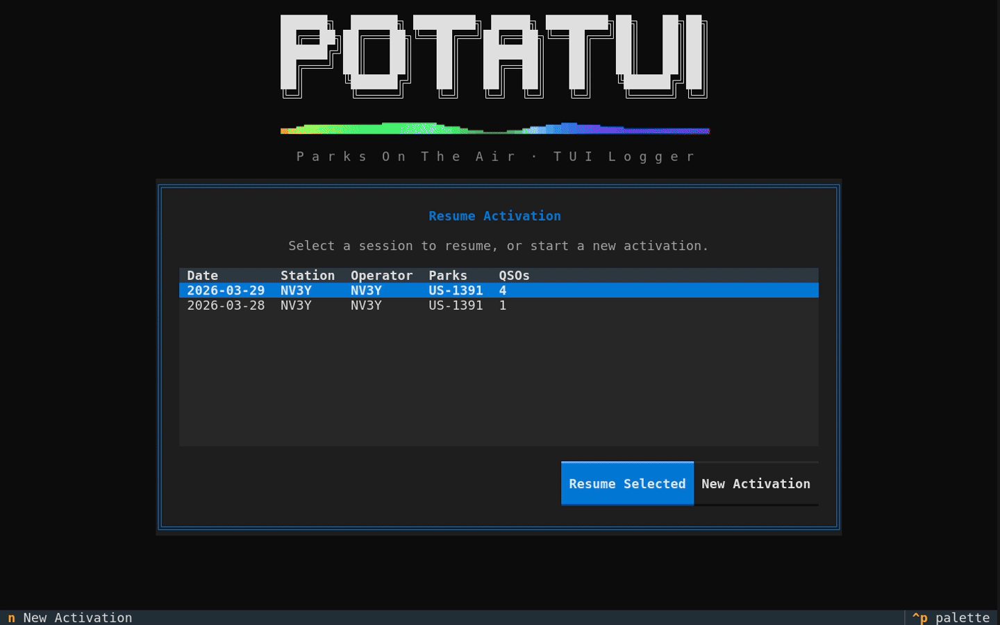

# Potatui
A terminal user interface (TUI) for logging Parks on the Air (POTA) activations.

> **Vibe coded.** This project was built entirely with AI assistance (Claude Code). It works well for my use case but comes with no guarantees. Use at your own risk, and always verify your log files before uploading to pota.app.



---

## Features

- **Built for activators** — fast logging, live POTA spots with one-press QSY, automatic ADIF export, and QRZ callsign lookup, all in a terminal that runs on any laptop you bring to the field.
- **P2P park lookup** — dedicated P2P field does a live lookup, displays the park name and distance/bearing from your park, and auto-fills the State field with the state abbreviation.
- **Callsign lookup** — name, location, distance, and direction from your park shown automatically as you type a callsign. First name and state auto-fill. Backfill (Ctrl+B) fills in missing names/states for all QSOs in a session. Uses QRZ XML if configured; falls back to HamDB.org (no account required) automatically.
- **POTA spots browser** — live spot list with band/mode/sort/search filters, auto-refreshes every 60 seconds. QSY directly to a spot with one keypress (tunes flrig, pre-fills callsign and P2P park). Distance from your park shown per spot. Worked activators shown in green.
- **Self-spotting** — post yourself to the POTA network from within the app. Your most recent spot is displayed live on the logging screen, showing who spotted you, how long ago, and any comments — colour-coded green/yellow/grey by age.
- **Offline park database** — a local copy of the full POTA parks list is downloaded on first launch and refreshed every 30 days. Park lookups work even without internet. Toggle full offline mode with Ctrl+N.
- **Solar/space weather indicator** — live NOAA Kp geomagnetic index shown in the header. Flashes red and fires a warning toast when any active space weather alert is issued. Click the pill to see the last 24h Kp history, a 3-day Kp forecast (colour-coded by severity), full alert text, and MUF/foF2 propagation prediction for your park's grid square (via [prop.kc2g.com](https://prop.kc2g.com/)). Polls every 10 minutes; skipped in offline mode.
- **Rig mode translations** — every rig labels its modes differently (CW-U, CW-L, PKTUSB, USB-D…). The mode translation editor (Settings → flrig section) lets you map your rig's mode strings to Potatui's canonical modes in both directions. Click "Fetch from flrig" to auto-populate from the rig's own mode list.
- **Commander** — fire CAT commands or run console commands via configurable slots with custom labels and keyboard shortcuts. Open the full panel with F7.
- **Resume activations** — on launch, pick any previous session to continue from where you left off.
- **ADIF export** — every QSO is appended to an ADIF file immediately. Full rewrite on edit, delete, or session end. Ready to upload to pota.app.
- **Multi-park and multi-op support** — enter multiple park refs at setup (e.g. `US-1234,US-5678`). Change operator callsign mid-activation (Ctrl+O) for club or guest-op scenarios; station and operator callsigns are tracked separately in the ADIF.

---

## Installation

### Requirements

- Python 3.11 or newer
- `git` (to clone the repo)

---

### Linux / macOS

```bash
# 1. Clone the repository
git clone https://github.com/MonkeybutlerCJH/potatui.git potatui
cd potatui

# 2. Create a virtual environment
python3 -m venv .venv

# 3. Activate it
source .venv/bin/activate        # bash/zsh
# source .venv/bin/activate.fish  # fish shell

# 4. Install Potatui and its dependencies
pip install -e .

# 5. Run it
potatui
```

To run again in a future session:

```bash
cd potatui
git pull          # optional: update to the latest version
source .venv/bin/activate   # or activate.fish
pip install -e .  # optional: only needed after an update
potatui
```

---

### Windows

```powershell
# 1. Clone the repository
git clone https://github.com/MonkeybutlerCJH/potatui.git potatui
cd potatui

# 2. Create a virtual environment
python -m venv .venv

# 3. Activate it
.venv\Scripts\Activate.ps1

# If you get a script execution error, run this first (once):
#   Set-ExecutionPolicy -ExecutionPolicy RemoteSigned -Scope CurrentUser

# 4. Install Potatui and its dependencies
pip install -e .

# 5. Run it
potatui
```

To run again in a future session:

```powershell
cd potatui
git pull          # optional: update to the latest version
.venv\Scripts\Activate.ps1
pip install -e .  # optional: only needed after an update
potatui
```

> **Windows terminal note:** Potatui works best in **Windows Terminal** (the modern one from the Microsoft Store). The legacy `cmd.exe` console has limited colour and Unicode support and is not recommended.

> **Config location on Windows:** the config file is stored at `%APPDATA%\potatui\config.toml` (e.g. `C:\Users\YourName\AppData\Roaming\potatui\config.toml`). Log files go to `Documents\potatui-logs\` by default.

---

## Configuration

The config file is created automatically on first launch. Its location is platform-specific:

| Platform | Path |
|----------|------|
| Linux    | `~/.config/potatui/config.toml` |
| macOS    | `~/Library/Application Support/potatui/config.toml` |
| Windows  | `%APPDATA%\potatui\config.toml` |

You can edit it by hand at any time, or press **F8** from the setup or logger screen to open the in-app settings editor.

**QRZ credentials (optional):** To keep usernames and passwords out of the config file, create a `.env` file in the same directory as `config.toml` (e.g. `~/.config/potatui/.env` on Linux) with:

```
POTATUI_QRZ_USERNAME=your_qrz_username
POTATUI_QRZ_PASSWORD=your_qrz_password
```

If these are set, they override any `[qrz]` username/password in `config.toml` and are not written back when you save settings. Existing TOML-based credentials still work unchanged.

```toml
[operator]
callsign       = "W1AW"
grid           = "EN34"
distance_unit  = "mi"    # "mi" or "km"

[logs]
dir = "~/potatui-logs"

[rig]
name     = "Yaesu FT-710"
antenna  = "EFHW"
power_w  = 100

[flrig]
host = "localhost"
port = 12345

[qrz]
username = ""
password = ""

[pota]
api_base   = "https://api.pota.app"
p2p_prefix = "US-"   # Change to "VK-", "GB-", etc. for non-US operators

[app]
theme        = "textual-dark"
offline_mode = false
```

Fields you fill in here will pre-populate the activation setup screen so you don't have to retype them each time.

---

## First Run

On first launch, if your callsign is not set, the **Settings** screen opens automatically so you can fill in your station details. Press **Ctrl+S** or click **Save Settings** to save and continue.

On first launch (or when the local park database is missing or outdated), Potatui will offer to download the full POTA parks list. This is a ~5 MB CSV file from pota.app and takes a few seconds. After that, park lookups work offline.

---

## Setup Screen

Fill in your callsign and park reference(s). Park refs use the POTA format: `US-1234`. For multi-park activations separate refs with a comma: `US-1234,US-5678`.

You can also **search by park name** — type at least two characters of the park name and a suggestion list will appear. Select a suggestion with the arrow keys and Enter to fill the ref. This also supports searching for multiple parks (type after the last comma).

The app looks up each park in the local database as you type and shows the park name inline. If needed it will fall back to the POTA API.

**Grid Square** is auto-filled from the first looked-up park. You can edit it manually if needed.

If a park spans multiple US states, a state selector appears — pick the state you're activating in. This is used for the `MY_STATE` ADIF field required by the POTA uploader.

If saved sessions exist, you'll see a resume screen first — select a session to pick up where you left off, or press `n` to start a new activation.

Press **F8** from the setup screen to open the Settings editor.

---

## Logger Screen

### Entry form fields

The entry form has two rows. Row 1 holds the fields you fill in for every QSO; row 2 holds optional fields.

**Row 1 (tab order):**

| Field      | Notes                                                                              |
|------------|------------------------------------------------------------------------------------|
| Callsign   | Auto-focus after each logged QSO. Accepts comma-separated callsigns for multi-op. Shows DUPE if duplicate on same band. |
| RST Sent   | Pre-filled with `5` — type the signal digits (e.g. `9` → `59`).                   |
| RST Rcvd   | Same.                                                                              |
| P2P Park   | Pre-filled with the configured prefix (default `US-`). Type digits. Live park name, distance, and bearing. Auto-fills State. |
| Freq (kHz) | Pre-filled from flrig or last known. Edit to override. Band updates automatically. |

**Row 2 (optional):**

| Field      | Notes                                                                              |
|------------|------------------------------------------------------------------------------------|
| Name       | Optional. Auto-filled from callsign lookup (QRZ or HamDB).                         |
| State/Loc  | Optional. Auto-filled from callsign lookup (2-letter state) or P2P park location.  |
| Notes      | Optional.                                                                          |

Press **Enter** from any field to log the QSO. UTC timestamp is stamped at log time.

### Header bar

```
W1AW | US-1234 Gifford Pinchot NF | 14:32z | 14225.0 kHz  20M  SSB | ● QSOs: 4  32/hr | 00:23:11     ◉ net  K:2.0
```

- QSO count shows today's contacts; if resuming a multi-day session, total is shown in parentheses.
- Rate meter shows QSOs per hour (based on last 60 minutes of activity).
- QSO count turns green and shows `✓` once you reach 10 contacts for a valid activation.
- At 100 QSOs, a rainbow border animation fires (once per session).
- **`net` indicator** — shows internet connectivity status (green/red/yellow for manual offline). Click it to open a Network Status panel showing the state of all services (POTA API, QRZ, HamDB, flrig, NOAA). From that panel, click the flrig or QRZ row to drill into their connection logs.
- **Solar/Kp indicator** shows the current NOAA planetary K-index: green (normal, Kp < 5), yellow (elevated, Kp 5–6), red (storm, Kp ≥ 7). Flashes red when any active space weather alert is present and fires a warning toast for each new alert (looks back 8 hours on startup). Click to open a detail modal with the last 24h Kp history, a 3-day Kp forecast with colour-coded bar graphs, alert text, and a propagation block showing the MUF (maximum usable frequency) and foF2 (F2 layer critical frequency) for your park's grid square, sourced from [prop.kc2g.com](https://prop.kc2g.com/). Shows `K:?` until the first successful poll.
- **Early/Late Shift indicator** — shows 🌅 or 🌙 in the header when you're within a POTA Early Shift (6-hour window) or Late Shift (8-hour window) for your park. Click the emoji to see the exact UTC window. For multi-state parks, uses the official POTA state/province pin per the award rules.
- When station callsign and operator callsign differ (after a Ctrl+O operator change), both are shown: `W1AW / NV3Y`.

### Key bindings

| Key        | Action                                                         |
|------------|----------------------------------------------------------------|
| F1         | About screen — app info and park database status/refresh       |
| F2         | Set run/CQ frequency — tunes flrig if connected                |
| F3         | Mode picker popup (SSB / CW / FT8 / FT4 / AM / FM)            |
| F4         | Toggle between QSO table and entry form                        |
| F5         | Open live POTA spots screen                                    |
| Ctrl+S     | Open live POTA spots screen (alias for F5)                     |
| F6         | Self-spot dialog                                               |
| F7         | Commander panel (CAT and console command slots)                |
| F8         | Settings editor                                                |
| F10        | End session — rewrites full ADIF and exits                     |
| Ctrl+N     | Toggle offline mode (skips all internet calls)                 |
| Ctrl+O     | Change operator callsign                                       |
| Ctrl+D     | Delete highlighted QSO (confirmation required)                 |
| Ctrl+L     | Callsign lookup for selected QSO (table mode)                  |
| Ctrl+B     | Backfill — fill missing names/states for all QSOs              |
| Enter      | Log QSO (from entry form) / Edit QSO (from table)              |
| Escape     | Return focus to Callsign field from QSO table                  |

Plus any custom shortcuts you've assigned to Commander slots.

### Changing frequency mid-activation

Press **F2** to open the Set Run Frequency dialog. Type the new frequency in kHz and press Enter. The header, entry form, and flrig (if connected) all update immediately.

### Editing QSOs

Press **F4** to move focus into the QSO log table. Use arrow keys to select any QSO, then press **Enter** to open the edit dialog. Press **Enter** in any field or click **Save** to save changes. Press **F4** or **Escape** to return to the entry form.

Press **Ctrl+L** to manually run a callsign lookup for the selected QSO and populate any missing name or state fields. To backfill all QSOs missing a name at once, press **Ctrl+B** from anywhere on the logger screen — this runs in the background without interrupting logging.

### Changing operators

Press **Ctrl+O** to open the operator change dialog. The new callsign is used for all subsequent QSOs. The station callsign (set at setup) remains unchanged and appears separately in the header. Both callsigns are written to the ADIF file.

---

## Spots Screen (F5 or Ctrl+S)

- Pulls live activator spots from the POTA API, refreshes every 60 seconds.
- The filter bar is hidden by default — press `f` to toggle it.
- Filter by band or mode using the dropdowns at the top.
- Sort by **Propagation**, **Distance** from your park, **Age** (newest first), or **Frequency**.
- Check **QRT** / **QSY** to hide spots with those comments in the spot text (both on by default).
- Check **Worked** to hide activators you've already logged this session.
- Press **Ctrl+F** to open a search bar and filter by callsign, park ref, or frequency.
- Distance is measured from your **park's location** (looked up on startup).
- Activators you've already worked this session are shown in **bold green**.
- Press `p` to toggle the **Propagation** column, which scores each spot's contact likelihood based on your session's QSO distances and current ionospheric conditions (MUF/foF2): `●` green = HIGH, `◐` yellow = MEDIUM, `○` red = LOW, `·` = unknown.
- Filter, sort, and search selections are remembered when you return to the screen.
- Press `r` to manually refresh.
- Highlight a spot and press **Enter** to QSY: tunes flrig if connected, pre-fills the callsign and P2P park fields back on the logger screen.
- Press `q` or **F5** to return to the logger.

---

## Self-Spot (F6)

Opens a dialog pre-filled with your current frequency, mode, park, and callsign. Add optional comments (e.g. `CQ POTA 20m SSB`) and submit. Your spot is posted to the [POTA spots page](https://pota.app/#/spots) where other operators can find your activation. Shows a toast notification on success or failure.

Set your frequency accurately with F2 before spotting.

---

## Commander (F7)

Supports both **CAT commands** (sent to the rig via flrig) and **console commands** (run as shell commands on your computer).

- **F7** — opens the Commander panel with two tabs: Fire and Configure.
- **Fire tab** — shows all configured slots with their labels. Click a button or use its assigned shortcut to fire.
- **Configure tab** — set the label, command, and keyboard shortcut for each slot.

Shortcuts are configured per-slot (e.g. `ctrl+1`, `f9`) and fire from anywhere on the logger screen. Reserved logger keys cannot be assigned.

Commander configuration is stored separately from the main config file, at:

| Platform | Path |
|----------|------|
| Linux    | `~/.config/potatui/commands.json` |
| macOS    | `~/Library/Application Support/potatui/commands.json` |
| Windows  | `%APPDATA%\potatui\commands.json` |

**CAT command examples:**

| Rig              | Command format      |
|------------------|---------------------|
| Yaesu FT-710     | `PB01;` – `PB05;`   |
| Yaesu FT-991A    | `PB01;` – `PB05;`   |
| Other rigs       | Check your manual   |

---

## Callsign Lookup

When a callsign is entered in the logger, Potatui looks up the operator's name, location, and grid (after a 1-second debounce). A strip below the entry form shows:

```
  QRZ: W6ABC  ·  Fred Smith  ·  Los Angeles, CA  ·  Grid: DM04  ·  NE 1,247 mi
```

The strip prefix shows the source (`QRZ:` or `HamDB:`).

- Distance is measured from your **park's location**, not your home QTH.
- Direction is shown as a 16-point cardinal (N, NNE, NE … NW, NNW).
- The operator's **first name** is automatically filled into the Name field if empty.
- The operator's **state** is automatically filled into the State field if empty and no P2P park has been entered.
- **Multi-callsign mode**: when multiple callsigns are entered (comma-separated), one lookup strip is shown per callsign. Name and state auto-fill use the respective callsign's data.
- **Ctrl+L** — manually re-run a lookup for the selected QSO (in table mode).
- **Ctrl+B (backfill)** — when resuming a previous session, look up all QSOs missing a name or state. Runs in the background without interrupting logging.
- Results are cached for the session — no duplicate API calls.

**Sources (tried in order):**

1. **QRZ XML** — richest data. Requires a QRZ account with an active XML data subscription. Enter credentials in **Settings (F8)**, or use a `.env` file in the config directory (see [Configuration](#configuration)) so they are not stored in `config.toml`. If not configured, skipped silently.
2. **HamDB.org** — free fallback, no account required. Used automatically when QRZ is not configured or returns no result.

**Distance units:** miles by default. Change to kilometres in Settings or by editing `distance_unit` in the config file.

---

## Offline Park Database

On first launch, Potatui downloads `all_parks_ext.csv` from pota.app (~5 MB) and stores it locally. After that:

- Park name lookups at setup and in P2P fields work without internet.
- The database is automatically refreshed if it's more than 30 days old.
- The internet status indicator in the header tells you if the live POTA API (for spots, self-spot, etc.) is reachable.

The database is stored in the platform data directory:

| Platform | Path |
|----------|------|
| Linux    | `~/.local/share/potatui/parks.csv` |
| macOS    | `~/Library/Application Support/potatui/parks.csv` |
| Windows  | `%LOCALAPPDATA%\potatui\parks.csv` |

**Manual update:** press **F1** from the logger screen to open the About panel, which shows the current database date and has a button to trigger a manual refresh.

**Offline mode (Ctrl+N):** press Ctrl+N to disable all internet calls for the current session. Useful when operating without connectivity. The header shows a manual-offline indicator. You can also set `offline_mode = true` in `config.toml` to default to offline on every launch.

---

## Settings (F8)

Opens the in-app settings editor from the setup screen or the logger screen. All config fields are editable here:

- Callsign, grid square, and distance units (mi/km)
- Log file directory
- Rig name, antenna, power
- flrig host and port
- Rig mode translations (via "Configure Mode Translations…" button)
- P2P park prefix (default `US-` — change to `VK-`, `GB-`, etc. for non-US operators)
- QRZ username and password

Press **Ctrl+S** or click **Save** to save and close. Changes are written immediately to the config file.

---

## Log Files

Files are saved to `~/potatui-logs/` by default on Linux, and `~/Documents/potatui-logs/` on macOS and Windows (configurable via `log_dir` in Settings):

```
~/potatui-logs/
  20260301-W1AW-US-1234.adi    ← ADIF, ready to upload to pota.app
  20260301-W1AW-US-1234.json   ← session state for resume
```

### Uploading to pota.app

1. Go to **pota.app → My Logs → Upload**
2. Upload the `.adi` file
3. For multi-park activations, upload each park's `.adi` file separately

The ADIF includes `MY_SIG=POTA`, `MY_SIG_INFO=<park ref>`, `STATION_CALLSIGN`, `OPERATOR`, `MY_STATE`, and `STATE` — all fields required by the POTA uploader.

---

## flrig Integration

flrig is a free rig control application that Potatui uses to read and set your radio's frequency and mode. [Download flrig](https://sourceforge.net/projects/fldigi/files/flrig/) — see the [initial setup guide](https://www.w1hkj.org/flrig-help/initial_setup.html) to get it talking to your rig.

Start flrig before launching Potatui. The app polls every 2 seconds and:

- Updates the frequency display in the header
- Updates the mode (F3 to override)
- Syncs the Freq field in the entry form (unless you're actively editing it)
- Automatically syncs USB/LSB sideband when you change mode or frequency

If flrig is not running, everything works normally. Frequency and band are taken from whatever is in the Freq entry field. The flrig connection status is visible by clicking the `net` pill in the header.

When you QSY to a spot (F5) or set a run frequency (F2), Potatui calls flrig to tune the radio automatically. If flrig is offline a warning toast is shown but the frequency is still updated in the display.

### Rig Mode Translations

Every rig labels its modes differently — your rig might use `CW-U`/`CW-L` instead of `CW`, `PKTUSB` instead of `FT8`, or `USB-D` for digital modes. The **Mode Translations** editor lets you configure how those mode strings map to Potatui's modes in both directions:

- **Inbound** — when flrig reports a mode string, what Potatui displays (e.g. `CW-U` → `CW`)
- **Outbound** — when you select a mode in Potatui, what string is sent to flrig (e.g. `CW` → `CW-U`)

Open it from **Settings (F8) → flrig Integration → Configure Mode Translations…**

Click **Fetch from flrig** to automatically populate the table from your rig's own mode list. Mappings are auto-guessed and can be edited. For SSB, leave the outbound field blank to keep automatic USB/LSB selection by frequency.

Translations are stored at:

| Platform | Path |
|----------|------|
| Linux    | `~/.config/potatui/mode_translations.json` |
| macOS    | `~/Library/Application Support/potatui/mode_translations.json` |
| Windows  | `%APPDATA%\potatui\mode_translations.json` |

If no translation file exists, built-in defaults are used as a fallback.

---

## License

[GPL-3.0-or-later](https://www.gnu.org/licenses/gpl-3.0.html) — free to use, modify, and distribute under the terms of the GNU General Public License v3 or later.
